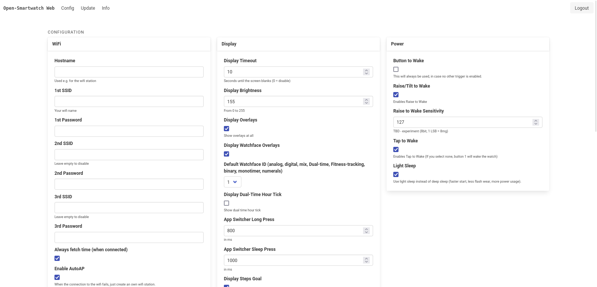

# Open-Smartwatch Web



This project is the web interface for the open-smartwatch. it connects to the OS using its built-in API and allows you to configure the watch.

## Development
You want to fix something? Just start the development server and start hacking!

```bash
nvm install v20.17.0 # First time only, install npm/node via nvm (https://github.com/nvm-sh/nvm)
nvm use v20.17.0
npm install # Install dependencies, only needed once
npm start
```

## Build
If you want to build the project, just run the build script. It will create a `dist` folder with the compiled files.

```bash
npm run build-osw
```

You should then be able to drop-in-replace the respective source-codes in the osw-os repository.

### The `dist` branch...
... is a special branch that contains the compiled files. It is used to provide the compiled files to the OSW-OS repository. As a maintainer you have to update the `dist` branch manually (do not forget to run `npm version ...`). You can use the `update-dist-branch.sh` script for updating the branch.

## Updates
Well, NPM is a wonderful thing. Just run `npm update` and you should be good to go. Not. IF this still leaves you with outdated packages, you can try to run:

```bash
npm outdated --json --depth=0 | \
jq --ascii-output --monochrome-output '. | keys | .[]' | \
xargs npm install $1 --save-dev --force
```
...and then `npm update`, fix conflicts in `package.json` until it builds again.

Finally, run `npm version` to update the version number in `package.json`, commit the changes and update the `dist` branch.
